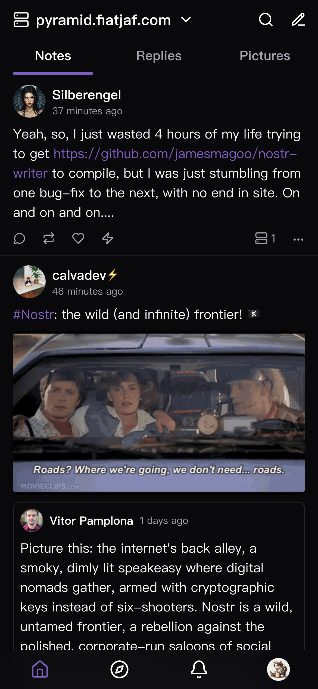

<div align="center">
  <picture>
    <source media="(prefers-color-scheme: dark)" srcset="./readme-resources/logo-dark.svg">
    <source media="(prefers-color-scheme: light)" srcset="./readme-resources/logo-light.svg">
    
  </picture>
  <p>logo designed by <a href="http://wolfertdan.com/">Daniel David</a></p>
</div>

# Jumble

A user-friendly Nostr client focused on relay feed browsing and relay discovery

## Features

- **Relay Feeds:** Explore content directly through relays without following specific users
- **Relay-Friendly Design:** Minimized and simplified requests ensure efficient communication with relays
- **Relay Sets:** Easily manage and switch between relay sets
- **Clean Interface:** Enjoy a minimalist design and intuitive interactions

## Screenshots


<div> 
  
  
  
</div>

## Run Locally

```bash
# Clone this repository
git clone https://github.com/CodyTseng/jumble.git

# Go into the repository
cd jumble

# Install dependencies
npm install

# Run the app
npm run dev
```

## Donate

If you like this project, you can buy me a coffee :)

lightning: ⚡️ codytseng@getalby.com ⚡️

bitcoin: bc1qx8kvutghdhejx7vuvatmvw2ghypdungu0qm7ds

geyser: https://geyser.fund/project/jumble

## License

MIT
